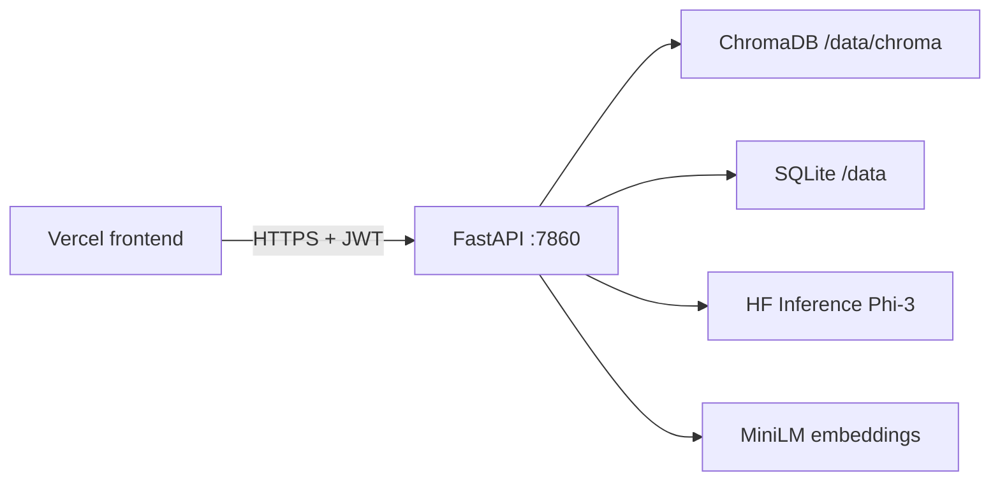

# FinSight FinGPT

FinSight is a financial document Q&A API: upload PDF statements, retrieve context with ChromaDB + embeddings, and get analyst-style answers via Hugging Face Inference (`microsoft/Phi-3-mini-4k-instruct`). FastAPI backend on port **7860**; connect the Vercel frontend with `VITE_API_URL`.

## Deploy backend on Hugging Face Spaces (Docker)

### 1. Create the Space

1. Go to [huggingface.co/new-space](https://huggingface.co/new-space).
2. Choose **Docker** (not Gradio SDK).
3. Connect this repository (or push only `backend/main llm` + root `Dockerfile`).

The root **`Dockerfile`** builds the FastAPI app from `backend/main llm/`, binds **`0.0.0.0:7860`**, and uses **`requirements-spaces.txt`** for a CPU-friendly dependency set.

### 2. Space secrets (Settings → Repository secrets)

| Secret / variable | Required | Description |
|-------------------|----------|-------------|
| `HF_API_TOKEN` | Yes | Hugging Face token with Inference API access |
| `HF_MODEL` | No | Default: `microsoft/Phi-3-mini-4k-instruct` |
| `JWT_SECRET` | Yes | Long random string for auth tokens |
| `GOOGLE_CLIENT_ID` | If using Google sign-in | OAuth client ID |
| `CORS_ALLOW_ORIGINS` | Yes for Vercel frontend | Comma-separated origins, e.g. `https://finsight-ai-ebon.vercel.app,http://localhost:5173` |

Optional:

- `HF_INFERENCE_PROVIDER` — default `auto` (recommended for Phi-3)
- `HF_INFERENCE_TIMEOUT_SECONDS` — default `120`
- `CHROMA_PERSIST_DIR` — default `/data/chroma` in Docker
- `FINSIGHT_SQLITE_PATH` — default `/data/finsight_users.db` in Docker
- `LOG_LEVEL` — `INFO` or `DEBUG`

### 3. Persistent storage

Mount a Space **persistent volume** at `/data` so uploads, Chroma index, SQLite, and HF cache survive restarts:

- `/data/uploaded_pdfs`
- `/data/chroma`
- `/data/finsight_users.db`
- `/data/hf-cache`

### 4. Connect the frontend (Vercel / local)

Set in the frontend build environment:

```bash
VITE_API_URL=https://YOUR-USERNAME-YOUR-SPACE.hf.space
```

No trailing slash. The app resolves API calls via `src/stores/settingsStore.ts` (`getResolvedApiBase()`).

Users can also override the API URL in FinGPT settings (stored in `localStorage`).

**CORS:** the backend must list your frontend origin in `CORS_ALLOW_ORIGINS`.

### 5. Verify deployment

```bash
curl https://YOUR-SPACE.hf.space/health
# {"status":"ok"}
```

Then sign in from the frontend, upload a PDF, and use **Ask**.

---

## Local development

### Backend

```bash
cd "backend/main llm"
python -m venv .venv
.venv\Scripts\activate   # Windows
pip install -r requirements.txt
copy .env.example .env   # set HF_API_TOKEN, JWT_SECRET, etc.
uvicorn main:app --reload --host 127.0.0.1 --port 8000
```

### Frontend

```bash
npm install
# .env.local
# VITE_API_URL=http://127.0.0.1:8000
npm run dev
```

### Docker (same image as Spaces)

From repo root:

```bash
docker build -t finsight-api .
docker run -p 7860:7860 -e HF_API_TOKEN=hf_xxx -e JWT_SECRET=change-me -e CORS_ALLOW_ORIGINS=http://localhost:5173 finsight-api
```

Open `http://localhost:7860/health`.

---

## Architecture (production)



- **PDF parsing:** lightweight `pypdf` extraction (no unstructured / hi_res).
- **Inference:** remote Hugging Face API only (no Ollama).
- **Memory:** single uvicorn worker, lazy embedding load, optional `PRELOAD_EMBEDDING_MODEL` in Docker.

---

## Environment reference

See `backend/main llm/.env.example`.
